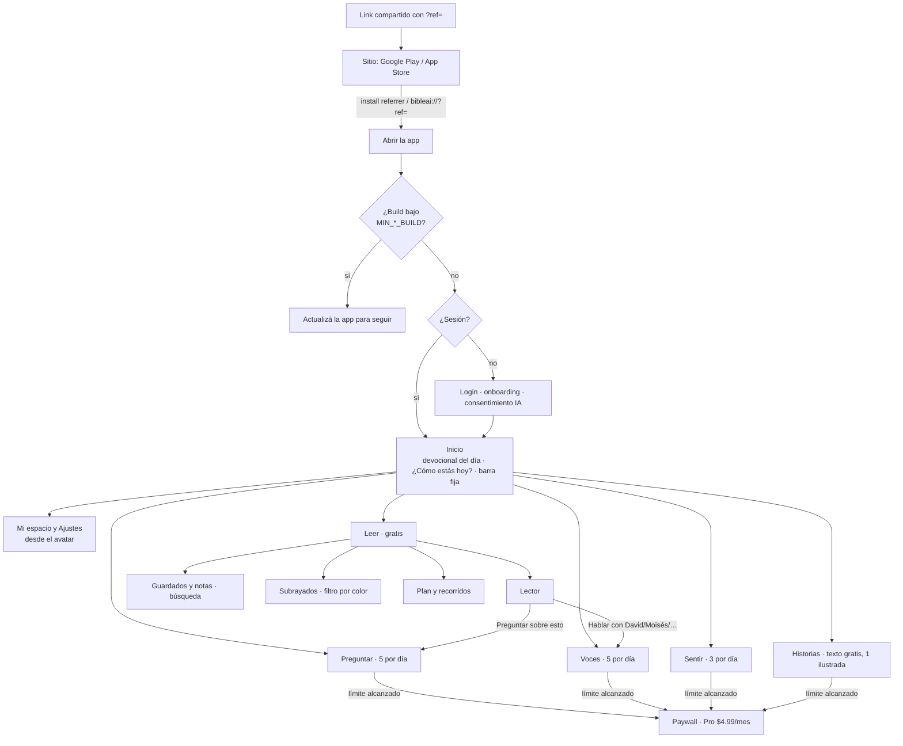

# Flujo de la app e ideas — 30 sep a 1 oct 2026

Bible AI Honduras está en beta cerrada (TestFlight y Google Play interno). Entre
el 30 de septiembre y el 1 de octubre entraron 13 PRs: 11 el 30 (#148–#180), #181
y el de atribución de invitaciones. Este documento junta el flujo completo, lo
construido y lo que queda.

## Flujo completo

Quien ya tiene sesión entra directo al inicio. Compartir sale de un solo
componente con código de invitación; Sentir no se comparte.

## Pantallas por módulo

| Módulo | Pantallas | Gratis | Pro |
| --- | --- | --- | --- |
| Inicio | home | Sí | — |
| Leer | leer, lector, plan, recorridos, guardados, subrayados | Sí | — |
| Preguntar | preguntar, chat | 5 por día | Sin límite |
| Voces | voces, chat por personaje (solo humanos, regla #2) | 5 por día | Sin límite |
| Sentir | sentir + "Los de antes" | 3 por día | Sin límite |
| Historias | historias, texto, ilustrada | Texto; 1 ilustrada de muestra | Ilustradas |
| Lo personal | Mi espacio, historial | Sí | — |
| Cuenta | ajustes, paywall | Sí | $4.99/mes |

## Lo construido

| PR | Qué |
| --- | --- |
| este PR | Atribución de invitaciones: sitio con descarga, install referrer de Play, link `bibleai://?ref=`, código a mano en Ajustes, `referrals:summary`, atributo `referred_by` en RevenueCat |
| #181 | Diagnóstico sin cuenta, actualización obligatoria, Lector → Voces, buscar en guardados y subrayados |
| #180 | Widget del versículo del día (abierto, requiere build nativo) |
| #179 | Mi espacio |
| #178 | Subrayar en 4 colores |
| #177 | Guardados con texto y notas personales |
| #176 | Chequeo de 31.102 versículos por versión |
| #175 | "Hace un año guardaste…" (servidor) |
| #165 | Scripts del RAG con `--version` |
| #164 | Docs de builds para la beta |
| #163 | Páginas legales a `site/` |
| #149 | Separador, plan "para empezar", inicio más claro, términos de uso |
| #148 | Versión visible y aviso de build nuevo |

## Ideas que quedan

Con ticket: #172 (tarjeta "Hace un año"), #171 (Face ID), #173 (exportar),
#153, #154, #157, #158, #159, #160, #161, #155, #151, #162.

Nuevos tickets, de ideas que no tenían: #182 (guardar y subrayar sin
conexión), #183 ("Tu año en la Palabra"), #184 (widget "Tu lectura de hoy"),
#185 (plan en grupo cerrado, N1), #186 (cómo moderar, N2), #187 (referencias
cruzadas, N4), #188 (guía para la célula, N5).

## Antes del lanzamiento

- [ ] Ratificar en Claude Design todo lo nuevo (#150 y lo de #177–#181 y este PR)
- [ ] QA en iOS y Android
- [ ] `npx convex deploy` en test y prod
- [ ] Build nuevo; `LATEST_*_BUILD`
- [ ] Redeploy de GitHub Pages (privacidad, términos y sitio con descarga)
- [ ] #152, #147, #143, #144
- [ ] Fusionar #180 después de probarlo en dispositivo
- [ ] Lanzamiento suave (#39)
