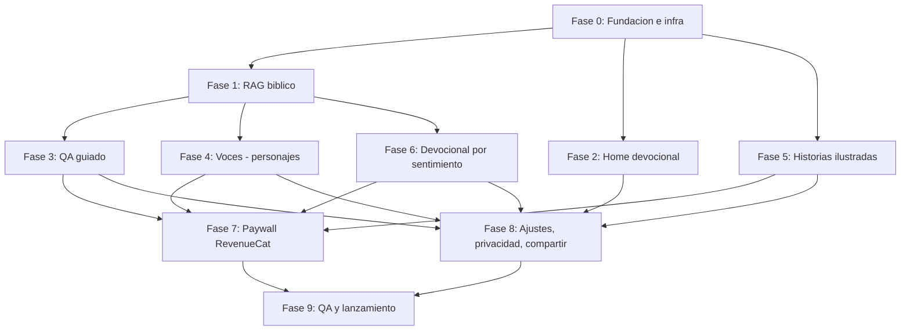

# Fases de implementación — Bible AI Honduras

**Fuente:** `PRD.md` (producto) + prototipo de Claude Design `Bible AI Honduras.dc.html` (UI de referencia).
**Builder:** una persona, con agentes de IA. **Plazo objetivo:** 8-10 semanas.
**Fuera de alcance v1:** comunidad completa (grupos/feed) — ver PRD sección 9c, es v1.1.

---

## Lista de fases

### Fase 0 — Fundación e infraestructura
- **Objetivo:** tener el esqueleto técnico sobre el que todo lo demás se construye.
- **Entregables:**
  - Proyecto Expo React Native con navegación que refleja las pantallas del prototipo (splash → auth → onboarding → permiso de notificación → home + hub de 4 accesos).
  - Sistema de diseño extraído del prototipo: paleta (`#E9E1D5`, `#3B352E`, `#B08260`, etc.), tipografía (EB Garamond serif + DM Sans), espaciados, componentes base (card, botón primario/secundario, chip).
  - Backend con auth (Google/Apple/email, como muestra el prototipo) y almacenamiento de usuario.
  - RevenueCat configurado con el producto Pro a $4.99/mes (sandbox).
- **Depende de:** nada.
- **Bloquea:** todas las fases siguientes.
- **Paralelizable con:** ninguna (primera fase).
- **Criterio de salida:** la app compila y corre en dispositivo/simulador mostrando splash → auth → onboarding → home con datos de prueba; el backend responde; una compra de prueba en sandbox de RevenueCat funciona.

### Fase 1 — RAG bíblico (motor compartido)
- **Objetivo:** el pipeline de contenido que alimenta los 3 módulos conversacionales (Q&A, personajes, sentimiento) — nunca opinión libre de la IA, siempre anclada al texto.
- **Entregables:** texto bíblico RVR1960 indexado (NVI si la licencia se resuelve a tiempo — si no, queda para v1.1); función de recuperación + respuesta con cita verificada; comentarios evangélicos de referencia integrados a la recuperación.
- **Depende de:** Fase 0 (backend).
- **Bloquea:** Fase 3 (Q&A), Fase 4 (Voces), Fase 6 (Sentimiento) — las tres comparten este motor.
- **Paralelizable con:** Fase 2, Fase 5 (spike de generación de imágenes).
- **Criterio de salida:** dado un pasaje + pregunta, o solo una pregunta libre, el pipeline devuelve una respuesta citando el versículo correcto.

### Fase 2 — Home: devocional diario progresivo
- **Objetivo:** la pantalla de entrada — versículo primero, devocional completo al expandir.
- **Entregables:** UI de home fiel al prototipo (card de versículo → expansión con imagen + reflexión); fuente de contenido diario (puede ser curada a mano para el lanzamiento, no depende de generación en vivo); notificación push programable; tarjeta de compartir por WhatsApp para este módulo.
- **Depende de:** Fase 0.
- **Bloquea:** nada crítico río abajo, pero es la pantalla que todo usuario ve primero — probarla temprano importa.
- **Paralelizable con:** Fase 1.
- **Criterio de salida:** al abrir la app se ve el versículo del día; el tap expande al devocional con imagen; la notificación dispara a la hora configurada; compartir genera una tarjeta con link.

### Fase 3 — Q&A guiado
- **Objetivo:** selector de libro → capítulo → versículo(s) + pregunta, o pregunta libre; respuesta citada; cuota gratis/Pro; compartir.
- **Entregables:** flujo de selección de pasaje (según prototipo), pantalla de chat, lógica de cuota diaria (3-5 gratis), integración de compartir.
- **Depende de:** Fase 1, Fase 0.
- **Bloquea:** Fase 7 (paywall necesita el gancho de "límite alcanzado" de este módulo).
- **Paralelizable con:** Fase 4, Fase 5, Fase 6.
- **Criterio de salida:** seleccionar pasaje y preguntar produce respuesta citada; alcanzar el límite gratis muestra la pantalla de límite; compartir funciona.

### Fase 4 — Voces: chat con personaje bíblico
- **Objetivo:** lista de personajes con avatar, chat 1ra persona, **regla dura: solo humanos** (Moisés, David, Pablo, Ester, etc. — nunca Jesús/Dios/Espíritu Santo en 1ra persona).
- **Entregables:** pantalla de selección de personaje, chat con avatar, prompt del sistema con el guardrail de personajes excluidos verificado con pruebas, cuota gratis/Pro, compartir.
- **Depende de:** Fase 1, Fase 0.
- **Bloquea:** Fase 7.
- **Paralelizable con:** Fase 3, Fase 5, Fase 6.
- **Criterio de salida:** hablar con "Moisés" da respuestas en 1ra persona ancladas al texto; pedirle a la IA que "hable como Jesús" es rechazado/redirigido a 3ra persona (verificado explícitamente, no solo asumido); cuota y compartir funcionan.

### Fase 5 — Generador de historias ilustradas
- **Objetivo:** catálogo de historias, generación de imágenes por escena, 1 muestra gratis de por vida + Pro ilimitado, visor de historia, compartir.
- **Entregables:** integración con proveedor de generación de imágenes (spike de costo/latencia/calidad recomendado apenas termine Fase 0, antes de comprometer el resto del calendario), catálogo de historias con escenas predefinidas, lógica de "1 muestra usada" persistente por usuario, visor con paneles, compartir.
- **Depende de:** Fase 0. (Soft-depende de Fase 1 si las escenas se redactan vía RAG en vez de a mano.)
- **Bloquea:** Fase 7.
- **Paralelizable con:** Fase 3, Fase 4, Fase 6.
- **Nota de riesgo:** esta es la fase de mayor riesgo técnico/costo del proyecto (generación de imágenes = el gasto variable más alto por usuario). Si el spike de costo/calidad no da resultados aceptables a tiempo, es la fase más defendible de recortar o simplificar sin romper el resto del producto.
- **Criterio de salida:** generar una historia produce 3+ escenas ilustradas; un usuario gratis solo puede generar 1 vez en total; Pro es ilimitado; compartir funciona.

### Fase 6 — Devocional por sentimiento/problema
- **Objetivo:** selector de sentimiento + texto libre → devocional a la medida (versículo + reflexión + oración corta), freemium igual que Q&A.
- **Entregables:** pantalla de selección de sentimiento/input libre, generación vía Fase 1, pantalla de resultado con oración y "para seguir leyendo", guardar/historial, cuota gratis/Pro.
- **Depende de:** Fase 1, Fase 0.
- **Bloquea:** Fase 7.
- **Paralelizable con:** Fase 3, Fase 4, Fase 5.
- **Criterio de salida:** elegir un sentimiento o escribir un problema produce un devocional coherente con oración; cuota gratis/Pro funciona igual que en Q&A.

### Fase 7 — Paywall y monetización (RevenueCat end-to-end)
- **Objetivo:** conectar los estados de "límite alcanzado" de los módulos 2-3-5-6 a la pantalla de paywall real; compra y desbloqueo inmediato.
- **Entregables:** pantalla de paywall ($4.99/mes, features Pro listadas, según prototipo), flujo de suscripción, verificación de entitlement que desbloquea los 4 módulos a la vez, restaurar compra.
- **Depende de:** Fase 0 (RevenueCat) + que Fase 3, 4, 5, 6 tengan su lógica de cuota/límite ya construida.
- **Bloquea:** Fase 9 (no se puede lanzar sin pagos funcionando).
- **Paralelizable con:** Fase 8.
- **Criterio de salida:** alcanzar el límite en cualquier módulo lleva al paywall; completar la compra desbloquea todo de inmediato; restaurar compra funciona.

### Fase 8 — Ajustes, privacidad y compartir (transversal)
- **Objetivo:** pantalla de ajustes (versión bíblica, modo oscuro suave, hora de recordatorio, borrar historial), y compartir por WhatsApp consistente en los módulos 1/2/3/5 con código de referido.
- **Entregables:** ajustes según prototipo, borrado real de historial (cumple la promesa de privacidad del PRD), toggle de versión bíblica que afecta todo el contenido citado, componente de compartir reusable con link + referido.
- **Depende de:** que Fase 2, 3, 4, 5, 6 ya tengan sus modelos de datos (para enganchar borrar-historial y version-toggle a algo real).
- **Bloquea:** Fase 9.
- **Paralelizable con:** Fase 7.
- **Criterio de salida:** cambiar de versión bíblica actualiza el contenido citado en la app; el modo oscuro se aplica en toda la app con la paleta suave; borrar historial elimina de verdad las conversaciones guardadas; cada módulo con compartir genera un link con código de referido.

### Fase 9 — QA, beta interna y lanzamiento
- **Objetivo:** prueba de punta a punta en dispositivo real, preparación para tienda, lanzamiento orgánico según el canal ya definido (redes personales + WhatsApp de iglesia).
- **Entregables:** pruebas E2E en iOS/Android reales, materiales de envío a App Store/Google Play (capturas, política de privacidad, notas de revisión explicando el contenido de IA + religión para anticipar preguntas del revisor), primer envío del mensaje de prototipo/lanzamiento a la red del fundador.
- **Depende de:** Fase 7, Fase 8.
- **Bloquea:** nada (fase final).
- **Criterio de salida:** la app pasa la revisión de las tiendas; el primer grupo de la red personal completa el flujo onboarding → pago sin errores críticos.

---

## Grafo de dependencias

## Tabla de oleadas (qué corre en paralelo)

| Oleada | Fases | Notas |
|---|---|---|
| 1 | Fase 0 | Bloqueante, todo lo demás espera esto. |
| 2 | Fase 1, Fase 2, spike técnico de Fase 5 | RAG, home, y una prueba temprana de costo/calidad de generación de imágenes — sin dependencias entre sí. |
| 3 | Fase 3, Fase 4, Fase 5, Fase 6 | Los 4 módulos restantes en paralelo, cada uno consumiendo el RAG de Fase 1. Es la oleada más grande — si hay que priorizar por riesgo de calendario, Fase 5 (imágenes) es la más recortable. |
| 4 | Fase 7, Fase 8 | Paywall y ajustes/privacidad/compartir, ambas integran sobre lo construido en la oleada 3. |
| 5 | Fase 9 | QA final y lanzamiento. |
